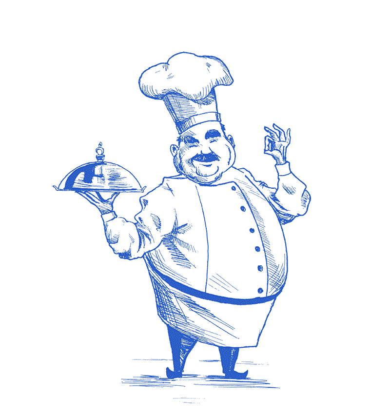

# css-frameworks-ca

Overview

This is a web application for a "FOOD IS LOVE" recipes platform, allowing users to share and find delicious recipes through a social media platform. The application is built using HTML, SCSS, JavaScript, and Bootstrap to create an intuitive and visually appealing user interface.

Target Audience

Its core target audience is primarily people between 30 to 45 years old who enjoy sharing and finding new recipes.

Features

- User Authentication: Users with @noroff.no or @stud.noroff.no can register, login and access their personalized profiles.
- View post feed: Users can view the recipes post from other users on the feed page.
- View post details page: Users can view the details post page when clicking a specific post.
- Post Creation: Users can create a post, sharing their favorite recipes, including images, body content, and tags.
- Post Update: Users can update their own post by name, body content or media.
- Delete post: Users can delete their own post.
- Search Functionality: Users can easily search for specific meals using the search bar.
- Category Filters: Listings can be filtered by categories such as dinner, italian, breakfast, and desserts recipes.
- Responsive Design: The application is designed to be responsive, ensuring a seamless experience across various devices.
- Update avatar: Users can update their own profile media.

Technologies Used

HTML: Used for structuring the content and creating the layout of the webpages.
SCSS: Employed to style and visually enhance the appearance of the application.
JavaScript: Implemented to add interactivity and dynamic behavior to the webpage.
Bootstrap: Utilized css framework for forms and layouts.

Getting Started

- Clone the repository to your local machine:
  git clone https://github.com/KarenBonillaM/css-frameworks-ca.git

- Install dependencies.
  npm install

- Build SASS.
  npm run build.

- Open js2 branch.

- Open the index.html file in your preferred web browser.
  Explore the different features, create posts, and experience the "FOOD IS LOVE" community.

Functionalities

- Home Page:
  This page displays two buttons. One that redirects to the register page and the other for users with an account redirects them to the login page.

- Login Page:
  Registered users can login with their Noroff email and password. If the credentials are correct users will be redirected to the personal profile page.

- Feed Page:
  Displays the general Food is Love posts. Every post card is a link that redirects to the details page.
  There is a search-bar where users can find their favorite recipes by title.
  In the nav-bar there is also a recipes dropdown where users can filter by categories such as breakfast, desserts, dinner and italian food.
  On the left hand, users are able to see their profile card information.

- Profile Page:
  Register users can see their profile card information. Including avatar image, user name, and a button that links to the functionality to update avatar image.
  Under the user information-card, users can see create a new post by clicking the "CREATE POST" button. Under the mentioned button we will see the user posts recipes, and every post has a button that redirects to the edit/delete post page.

- Create New Post Page:
  Register user can upload a new recipe post. To the left side we can find the form the create the post and when it is successfully uploaded we will see the new post on the right side.

- Edit/Delete Post Page:
  Here users can edit or delete their own posts. We will see a image of the post and under it we will find the form that help us to edit. There is also a delete post button.

Usage

- Register an account and then log in.
- Create a post for your page of "Food is Love" by providing details and images.
- Browse through available listings using the search bar or category filters.
- View your personalized profile to track your recipes posts.

Credits

This project was created by Karen Bonilla.
Images sourced from Unsplash and Freepik.
License
